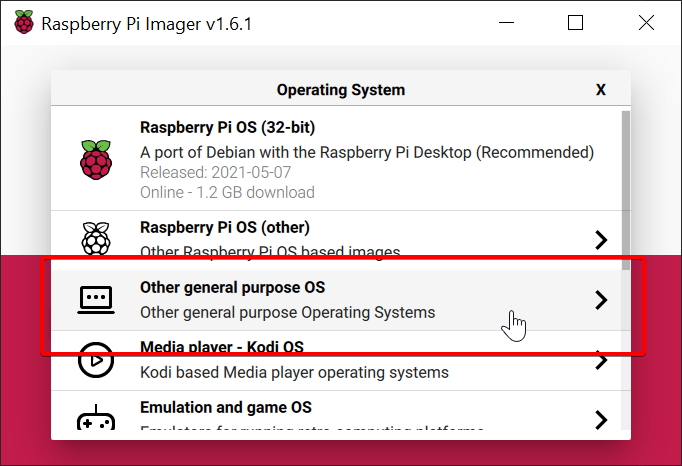
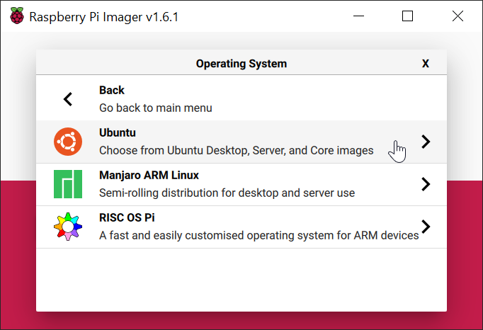
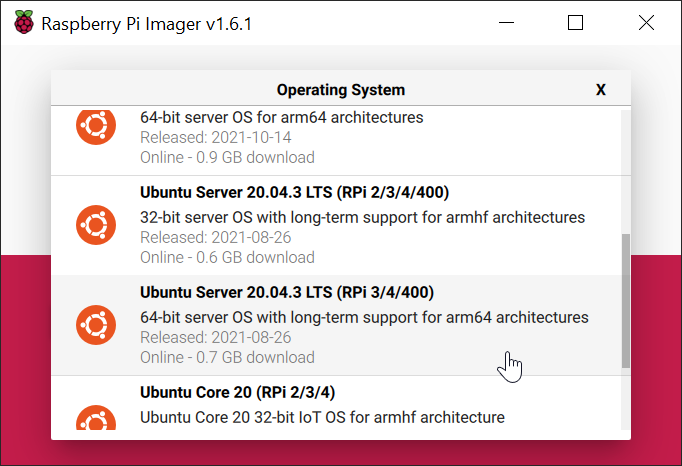
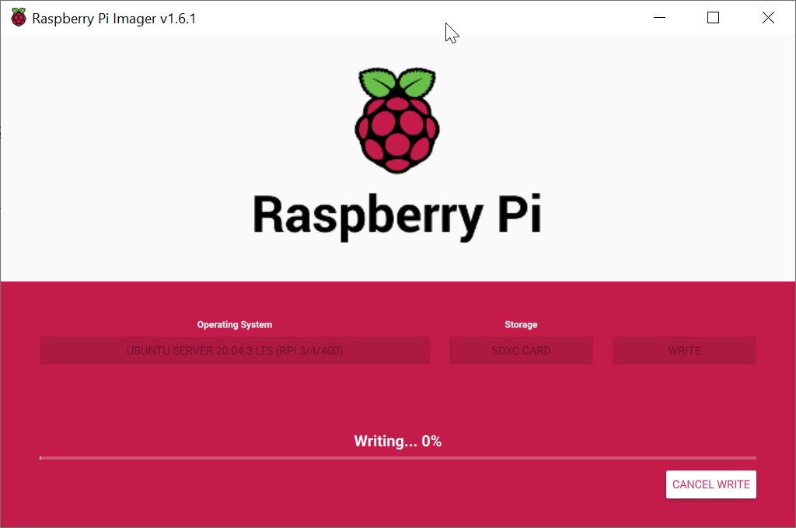
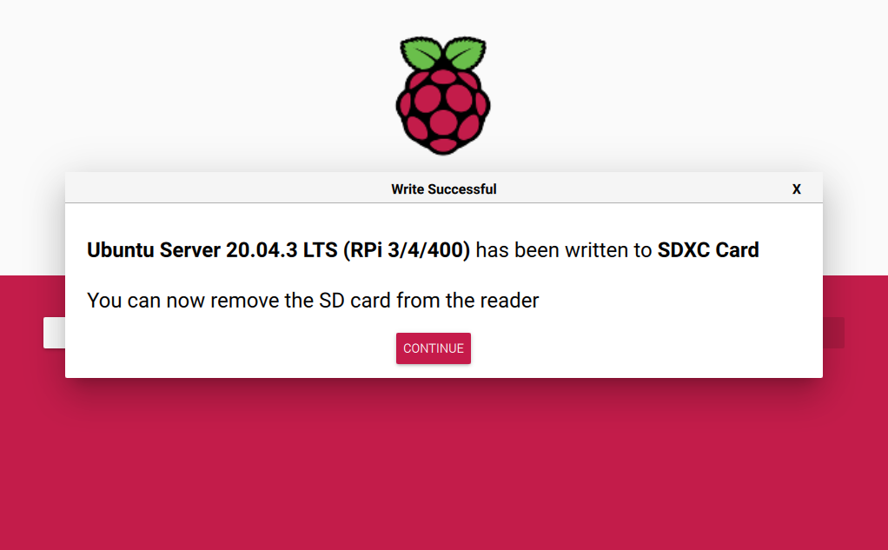
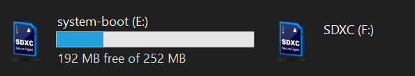
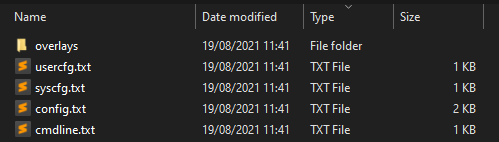
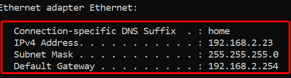
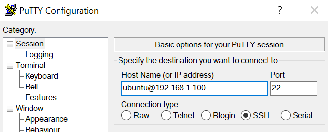
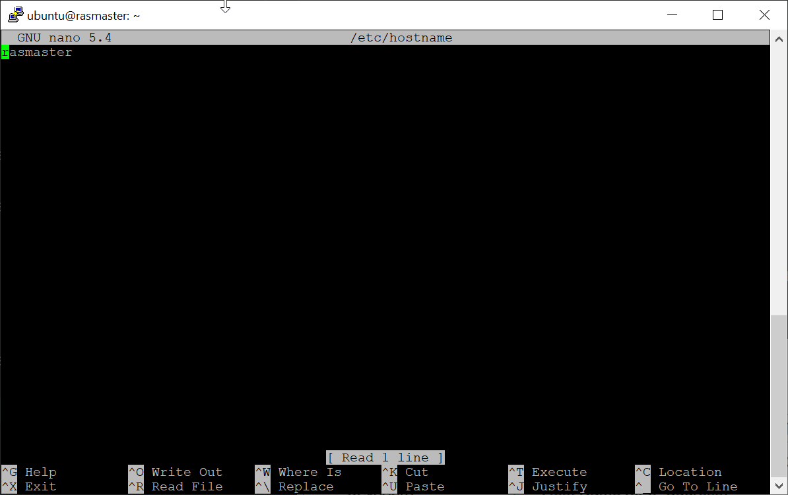

# Au!(tomating) your Home - clustering your home

Sometimes you just have some spare time on your hands. No idea what to do! So you start tinkering around and within no time you got some kind of setup running.  
Not knowing how it all started you try and create your best implementation possible.

In this short series I will share my experience and how-tos on how to build **_and_** maintain your home cluster.   
The end goal will be to automate your entire home and have it properly backed up.


## Prerequisites
All projects require some things that are needed or things you have to know upfront. I have summarized some requirements down below.

- Basic Linux knowledge
- A single Raspberry Pi model 4 (It should work with model 3 as well, but 64 bit is not supported.)
- Micro SD card with at least 8 GB
- Very basic Kubernetes experience
- Internet
- Spare time


## PI preparation

The time has finally begun. We will need to use an image on the new PI. We will also enable SSH and make the Pi run at a decent 1750 mhz. 
This will heavily speed up most operations that are done. 


### Imaging

The image I've chosen allows us to run 64bit ARM images.
I've also to use the LTS (long term support) version, as these have the tools available to you that are required for the installation.

You can choose _any_ distribution if you want to change it up a bit.

#### Step 1 - Choosing an OS.


#### Step 2 - Use Ubuntu for a quick setup.


#### Step 3 - Choose server version with the LTS option 


#### Step 4 - Wait around for the writing to complete


#### Step 5 - Have more spare time for yourself.
The imaging process will take some time to complete. Just sit back and enjoy some of the scenery around you.


#### Step 6 - Have more spare time for yourself.


That is it! After this the image is written to your SD card.


### Configuring

Well done! You've made it this far. We will begin with speeding up the Pi. It really helps speeding up your Pi. You'd be surprised how much it will be able to do in such little time.
We will also focus on setting up remote access using SSH. Next to that we will enable the proper networking to enable the access to the Raspberry Pi.


#### Changing the Pi boot data

To start the next step we will have to reconnect the Micro SD card to start configuring the Raspberry Pi. After a reconnect you will be able to see the following partitions:



The partition we need is `system-boot`, especially the `usercfg.txt` the `cmdline.txt` and the file `network-config`.



We will start by creating an empty file named `ssh`. It will enable SSH access which will be required later.  
After this we will open the `usercfg.txt` file. It should look something like this:

```shell
# Place "config.txt" changes (dtparam, dtoverlay, disable_overscan, etc.) in
# this file. Please refer to the README file for a description of the various
# configuration files on the boot partition.
```

Modify this file to include the ARM speedup:

```shell
# Place "config.txt" changes (dtparam, dtoverlay, disable_overscan, etc.) in
# this file. Please refer to the README file for a description of the various
# configuration files on the boot partition.
over_voltage=2
arm_freq=1750
```
What this will do is speedup the Pi from 700 mhz to 1750 mhz. If there is no adequate cooling available the Pi will clock itself down to accommodate the change at runtime. You will see quick bursts of speed and after that it will slowly slow down.

Next up is enabling the Pi to allow for running containers.

Opening the file `cmdline.txt` we will be greeted by the following line
```shell
net.ifnames=0 dwc_otg.lpm_enable=0 console=serial0,115200 console=tty1 root=LABEL=writable rootfstype=ext4 elevator=deadline rootwait fixrtc
```

To enable containers to run we will have to add `cgroup_enable=cpuset cgroup_memory=1 cgroup_enable=memory`:
```shell
net.ifnames=0 dwc_otg.lpm_enable=0 console=serial0,115200 console=tty1 root=LABEL=writable rootfstype=ext4 elevator=deadline rootwait fixrtc cgroup_enable=cpuset cgroup_memory=1 cgroup_enable=memory
```
This configures cgroups to allow for proper resource management in the cluster later down the line.

Next up is the network configuration. 
I will **_assume_** you are running inside a network with `192.168.1.xxx` and your Pi will be reachable on `192.168.1.100`. This is the most standard and most easily copy-pasted. 

My home network is running on `192.168.2.xxx`.  
To check in which subnet you are running you can check your own ipaddress and remove the last part of your own IP.



192.168.2.23 will become subnet 192.168.2.0/24.

Open up the file `network-config` and find the following config.
```yaml
version: 2
ethernets:
  eth0:
    dhcp4: true
    optional: true
```

You can change this to 
```yaml
version: 2
ethernets:
  eth0:
    dhcp4: no
    dhcp6: no
    addresses: [192.168.1.100/24]
    gateway4: 192.168.1.YYY # <-- Fill in! 
    nameservers:
      addresses: [1.1.1.1,8.8.8.8]
```

This will make sure your Pi is reachable on `192.168.1.100`.

### The fun part!

Now everything is set up it is finally time to boot the Pi! Insert the SD card, insert the ethernet cable and add some power.

If everything went correctly you can log in to the Pi over SSH. To try this out we will utilize a program called [Putty](https://www.putty.org/).

  
The username/password combination will be ubuntu/ubuntu.


Once the login is done you can issue the following commands to install the proper networking capabilities for the Kubernetes cluster on your Pi:  
```shell
sudo apt-get update
sudo apt install linux-modules-extra-raspi
```

This will make sure proper networking is in place.  

Next up we have to change nftables(new) to iptables(legacy). The reason why can be found [here](https://rancher.com/docs/k3s/latest/en/advanced/#enabling-legacy-iptables-on-raspbian-buster)
```shell
sudo iptables -F
sudo update-alternatives --set iptables /usr/sbin/iptables-legacy
sudo update-alternatives --set ip6tables /usr/sbin/ip6tables-legacy
```
This will make sure you will be running the "old style" of networking. 

To choose a new name for your master node we can edit the hostname:

```shell
sudo nano /etc/hostname
```
Pick a new name and save this file. I will use `rasmaster` as this pi will be used for a raspberry pi master node.


After al this configuration it is finally time to **_reboot_**.

### The most funnest part!

It is time. It has begun. Your first "cluster" is ready to be installed.

There is luckily only 1 command left to run;
```shell
curl -sfL https://get.k3s.io | sh -s - --flannel-backend=ipsec
```

This setup can take some time to finish so grab another cup of coffee.


After this you can check your cluster is available using the following command:
```shell
$ sudo k3s kubectl get pods --namespace kube-system
NAME                                      READY   STATUS      RESTARTS   AGE
helm-install-traefik-htv68                0/1     Completed   0          31s
coredns-79b4cf46bd-qdgcj                  1/1     Running     0          31s
local-path-provisioner-7456d89455-5hfch   1/1     Running     0          31s
traefik-758b46f7fd-99pgh                  1/1     Running     0          31s
svclb-traefik-k7nwh                       2/2     Running     0          31s
```

Congratulations! This is the first step towards running your own cluster in your own home. Next week we will start handling how to add a singular node, do monitoring/metrics and view the cluster remotely.
If you got any questions, remarks or best practices do not feel afraid to comment. I'd like to include them later down the line to create the best solution possible. 
